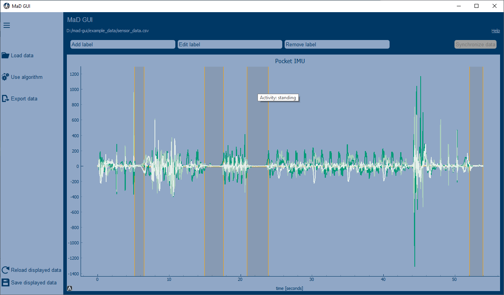
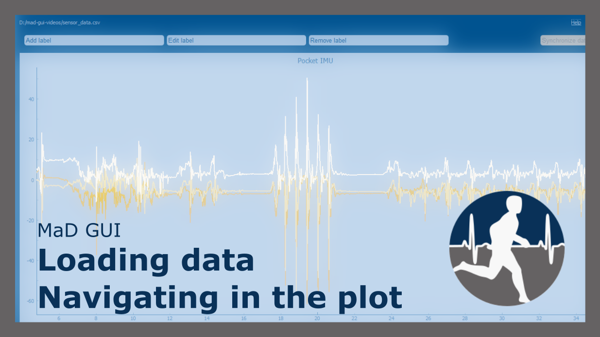
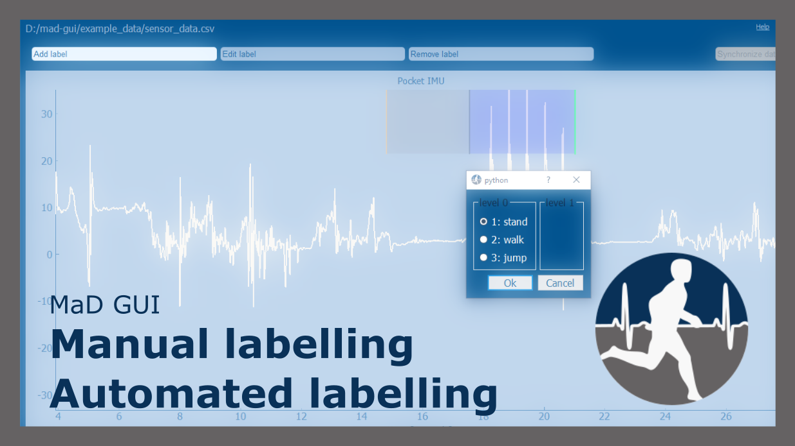
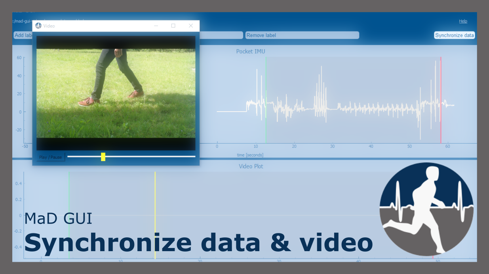

# MaD GUI 
**M**achine Learning 
**a**nd 
**D**ata Analytics 
**G**raphical 
**U**ser 
**I**nterface

[](https://github.com/mad-lab-fau/mad-gui/actions/workflows/test_and_lint.yml)
[](https://mad-gui.readthedocs.io/en/latest/?badge=latest)
[](https://pypi.org/project/mad-gui/)
[](https://github.com/psf/black)


MaD GUI is a basis for graphical annotation and computational analysis of time series data.
It gives easy access to plotted data / annotations and handles interaction with annotations for you in the background.
**Developers must create plugins and inject them into the GUI to read data of their format or use their algorithm.**

<div align="center">

:warning:  :warning: <br />
This is still an early version. Things might not work as expected. <br />
Experiencing issues? [Report a bug here!](https://github.com/mad-lab-fau/mad-gui/issues/new?assignees=&labels=&template=bug_report.md&title=%5BBUG%5D)


<i>click to enlarge the image</i>

[](https://mad-gui.readthedocs.io/en/latest/_static/images/MaD-GUI.png)

<i>click images below to show videos on YouTube</i><br />
<i>(open video descriptions on YouTube for chapters)</i>

[](https://www.youtube.com/watch?v=cSFFSTUM4e0 "MaD GUI - Loading data and navigating in the plot")
[](https://www.youtube.com/watch?v=n96eO7TAItg "MaD GUI - Labelling data manually or using an algorithm")
[](https://www.youtube.com/watch?v=-GI5agFOPRM "MaD GUI - Synchronize video and sensor data")

</div>
  
## Quickstart for developers

In a python 3.7 environment, execute the following commands or use the section [Development installation](#development-installation):
```
pip install mad_gui
mad-gui
```
You can [download our example data](#example-data) to
test our built-in exemplary importer, exemplary algorithms and exemplary label. 
To see how to open our example data within the GUI, please refer to our section about the 
[User Interface](#user-interface).

## Contents of this readme

|General Information | Development | Additional Information |
|---------------------|-----------|-------------------------|
|<li>[Why and what?](#why-and-what)</li><li>[Download / Installation](#download--installation)</li><li>[Example data](#example-data)</li><li>[User Interface (Videos & Shortcuts)](#user-interface)</li><li>[Load / display data of any format](#load-and-display-data-of-any-format)</li><li>[Use a custom algorithm](#use-a-custom-algorithm)</li><li>[Terminology](#terminology)</li>|<li>[Development installation](#development-installation)</li><li>[Developing Plugins](#developing-plugins)</li><li>[Communicating with the user](#communicating-with-the-user)</li><li>[Adjusting Constants](#adjusting-constants)</li><li>[Changing the theme](#changing-the-theme)</li><br><br>|<li>[Support & Contributing](#support-contributing)</li><li>[Background](#background)</li><br><br><br><br><br>|


## Why and what?
Existing graphical user interfaces (GUIs), that deal with time series data, usually do not allow support of annotation 
by algorithms, although such algorithms exist.
If they do, the algorithm and the GUI are tightly coupled, such that reusing it becomes hard.

Furthermore, algorithms that were developed to analyze time series data, can usually not be used by researchers, who do
not have programming experience, although the algorithms were developed for their research area. This is for example the 
case in the area of gait analysis, where algorithms are provided by computer scientists and need to be used by clinical 
researchers.

The MaD GUI can be used as a framework to incorporate algorithms for supporting time series annotation and for using
algorithms for analyzing time series data even without having programming experience. You can read about this in more 
detail in our [Background](#background) section.

## Download / Installation

### Plugin Developers

Please see the section [Development installation](#development-installation).

### GUI user: Standalone executable
You do not need to install anything. Simply download the file from the table below for your regarding operating system. 
Afterwards you can start the GUI as described in the rightmost column of the table.

When downloading a file from the table, your browser may warn you that this is a potentially dangerous file.
You will only be able to use our GUI by selecting "Keep anyway / download anyway / ...".
In the case of Microsoft Edge, this possibility is hidden, but you can select it after downloading as explained [here](https://docs.microsoft.com/en-us/deployedge/microsoft-edge-security-downloads-interruptions#user-experience-for-downloads-lacking-gestures).

| Operating system       | File to download | What to do                                        |
|------------------------|------------------|---------------------------------------------------|
| Windows                | [Windows (64 bit)](https://github.com/mad-lab-fau/mad-gui/releases/download/v0.2.1-beta.1/mad_gui.exe)       | Download the file on the left. Then open the downloaded file and **read about [example data](#example-data) in the section below this table.** <br /> <br />*Note: If prompted with a dialog `Windows protected your PC`, click `More info` and then select `Run anyway`.* |
| Ubuntu                 | [Ubuntu (64 bit)](https://github.com/mad-lab-fau/mad-gui/releases/download/v0.2.1-beta.1/mad_gui_ubuntu) | Download the file on the left. Then, in your terminal, navigate to the file loaction and then: `chmod +x ./mad_gui_ubuntu` and then `./mad_gui_ubuntu`. <br /> <br />*Note: you might need to install some additional packages. You can use [this script](https://raw.githubusercontent.com/mad-lab-fau/mad-gui/main/unix_dependencies.sh) to do so. Just right click the link, save it on your machine and execute it.*|
| Mac OS                 | [Mac OS (64 bit)](https://github.com/mad-lab-fau/mad-gui/releases/download/v0.2.1-beta.1/mad_gui_mac.zip) | <li>Download the file on the left and extract it, for example to a folder called `mad_gui`.</li><li>Right click on the folder `mad_gui` and choose "New Terminal at Folder"</li><li>In the terminal, type `sudo -xvf mad_gui.tgz` and press return.</li><li>Close the terminal.</li><li>Right click on the file mad_gui_mac, select "Open", and confirm that you want to open the file.</li><li>Wait about half a minute until the GUI opens</li><li> You can **read about [example data](#example-data) to load in the GUI in the section below this table.**</li> <br /><br /> *Note: If your Mac does not allow you to open this file, perform the actions for "If you want to open an app that hasn’t been notarized or is from an unidentified developer" on the [Apple Support Page](https://support.apple.com/en-us/HT202491). Afterwards, try to open it again as described above.*|
| other                  | Supplied upon request |[Contact us](mailto:malte.ollenschlaeger@fau.de)  


## Example Data

After clicking [this link](https://raw.githubusercontent.com/mad-lab-fau/mad-gui/main/example_data/sensor_data.csv), you can download our example data by either using `Ctrl+S` on your keyboard or click the right mouse button and then select `Save as...` to save it on your machine.
Make sure to remember, where you save this file.
After starting MaD GUI, you can open the previously downloaded example data as shown in [User Interface](#user-interface). 


You want to load / display data of a specific format/system or want to use a specific algorithm? 
In this case please refer to [Load and display data of a certain data type](#load-and-display-data-of-any-format)

You want to load / display data of a specific format/system or want to use a specific algorithm? 
In this case please refer to [Load and display data of a certain data type](#load-and-display-data-of-any-format)

## Terminology

| Word | Meaning |
|------|---------|
|Annotation| An annotation has a start and a stop value, e.g. it goes from second 1 to second 2 of the time series data.|
|Label| An annotation is always of a certain type, for example "Activity". These types are called labels. A Label keeps the possible descriptions of an annotation. For example, the label "Activity" can have the descriptions "walk" or "run". Furthermore, it keeps information about where the annotation should be plotted, e.g. lowest 20% of the plot. |
|User| Someone who performs actions in the GUI using the mouse and keyboard.|
|Developer| Someone who creates plugins for the GUI, for example to load a specific data format or to use a specific algorithm.


## User Interface

You can get information on how to use the GUI from the keywords below or from the video referenced in each of the sections.
You may also want to take a look at [ACQ4 documentation](http://acq4.org/documentation/userGuide/userInterface/graphics.html#mouse-interaction) to learn about mouse interaction with the plots (e.g. zooming).

### Load data

| Text | Exemplary Video |
|------|-----------------|
|<li>Click `Load data` button on the left</li><li>Select recording system in dropdown</li><li>`Select data file` to specify the sensor data to be loaded</li><li>Optionally: select video to be displayed</li><li>Optionally: select annotations previously calculated using another program <br> (do not confuse with [Use Algorithm](#use-algorithm), see below.)</li><li>Click `Start`</li>|[](https://www.youtube.com/watch?v=cSFFSTUM4e0 "MaD GUI - Loading data and navigating in the plot")|

### Use algorithm

Passes the currently displayed data to an algorithm, which then calculates new annotations or features for existing annotations.

| Text | Exemplary Video |
|------|-----------------|
|<li>Click `Use algorithm` button on the left</li><li>Select algorithm</li><li> Click `Start processing`</li>|[](https://www.youtube.com/watch?v=n96eO7TAItg "MaD GUI - Labelling data manually or using an algorithm")|

### Synchronize sensor data and video

Please watch the video:

[](https://www.youtube.com/watch?v=-GI5agFOPRM "MaD GUI - Synchronize video and sensor data")


### Export data

Exports displayed annotations into an excel file. 
If you want to export displayed sensor data, either use the `Save displayed data` button.
If you want to customize exports, please create an Exporter.

### Shortcuts
Please watch the videos linked above, if you want to learn more about the different actions.

| Shortcut                      | Mode           | Action |
|------------------------------|---------------|-------|
| `a`, `e`, `r`, `s`, `Esc`    | all           | Switch between modes *Add label*, *Edit label*, *Remove label*, *Synchronize data*|
| `Left Mouse Click`           | Add label     | Set start/end of a label|
| `Space`                      | Add label     | Can be used instead of `Left Mouse Click` |
| `1`, `2`, `3`,... `TAB`      | Add label     | Navigate in the pop-up window |
| `Shift` + `Left Mouse Click` | Add label     | Start a new label directly when setting the end of a label |
| `Ctrl` + `Left Mouse Click`  | Add label     | Add a single event |

## Load and display data of any format
This will need someone who is familiar with Python, who has to develop a plugin of the type `Importer`.
For more information on how to create plugins, please refer to [Developing Plugins](#developing-plugins).
You do not have experience with python but still want to load data from a specific system? [Contact us!](mailto:malte.ollenschlaeger@fau.de)

## Use a custom algorithm
This will need someone who is familiar with Python, who has to develop a plugin of the type `Algorithm`.
For more information on how to create plugins, please refer to [Developing Plugins](#developing-plugins).
You do not have experience with python but still want to load data from a specific system? [Contact us!](mailto:malte.ollenschlaeger@fau.de)


## Development
In case you experience issues, please try to find a solution in our documentation regarding [Troubleshooting](https://mad-gui.readthedocs.io/en/latest/troubleshooting.html#development).

### Development installation

Info: We recommend to use `pip install mad_gui` in a 
clean python 3.7 [conda environment](https://mad-gui.readthedocs.io/en/latest/preparation.html#installing-necessary-software), or if you know what you are doing in a [python venv](https://docs.python.org/3/library/venv.html#creating-virtual-environments).
. 

```
pip install mad_gui
```
Then, from your command line simply call:

```
mad-gui
```

Alternatively, within a python script use our [start_gui](https://mad-gui.readthedocs.io/en/latest/modules/generated/mad_gui/mad_gui.start_gui.html#mad_gui.start_gui) function: 

```
from mad_gui import start_gui
start_gui()
```

If you want to see an example, [download our example data](#example-data).
Afterwards, you can open the previously downloaded example data as shown in 
[User Interface](#user-interface).
You want to load data of a specific format/system or want to use a specific algorithm? 
In this case please refer to the sections
[Load and display data of a certain data type](#load-and-display-data-of-any-format)
and [Use a custom algorithm](#use-a-custom-algorithm).

### Developing plugins

The MaD GUI package can be extended with different kinds of plugins and labels.
The user can access your plugins within the GUI using dropdowns, after clicking "Load data" or "Use algorithm". 
**However, this is only possible if your plugin was passed to the GUI at startup**, as we show it for an importer 
in [this GIF](https://mad-gui.readthedocs.io/en/latest/_static/gifs/importer.gif), or as shown in this code snippet:

```python
from mad_gui import start_gui
from my_importer import MyImporter
from my_algorithm import MyAlgorithm
from my_labels import MyFirstLabel, MySecondLabel

# only passing plugins
start_gui(plugins=[MyImporter, MyAlgorithm])

# passing plugins and labels
start_gui(plugis=[MyImporter], labels=[MyFirstLabel, MySecondLabel])

```

In the sections in the following list we describe how you can develop your own plugins and labels, which must inherit one of our 
[base plugins](https://mad-gui.readthedocs.io/en/latest/modules/plugins.html#plugins) or 
[BaseRegionLabel](https://mad-gui.readthedocs.io/en/latest/modules/generated/plot_tools/mad_gui.plot_tools.labels.BaseRegionLabel.html#mad_gui.plot_tools.labels.BaseRegionLabel).
**Each of these sections keeps working example to get you started as quick as possible**:

   - Importer: [Load and display data of any format](https://mad-gui.readthedocs.io/en/latest/plugin_importer.html#importer)
   - Algorithm: [Create annotations for plotted data](https://mad-gui.readthedocs.io/en/latest/plugin_algorithm.html#algorithm)
   - Algorithm: [Calculate features for existing annotations](https://mad-gui.readthedocs.io/en/latest/plugin_algorithm.html#algorithm)
   - Exporter: [Export displayed annotations](https://mad-gui.readthedocs.io/en/latest/plugin_exporter.html)
   - Labels: [Create one or several custom label classes](https://mad-gui.readthedocs.io/en/latest/labels.html)
   - For supplementary basic information please refer to [Preparation](https://mad-gui.readthedocs.io/en/latest/preparation.html).

## Communicating with the user

### Pop-up
If - at any point - you want to send a message to the user of the GUI, you create a message box with an OK button like
this:

```python
from mad_gui.components.dialogs.user_information import UserInformation

UserInformation.inform_user("Your message")

# will return PySide2.QtWidgets.QMessageBox.Yes or PySide2.QtWidgets.QMessageBox.No
yes_no = UserInformation().ask_user("Yes or No?") 
```

### Tooltip of labels

You can display results of your algorithms for example by putting the results into the label's description as shown in our section about [custom algorithms](https://mad-gui.readthedocs.io/en/latest/plugin_algorithm.html#algorithm-which-creates-features-for-existing-annotations).

## Adjusting Constants

You can create your own settings by creating a class, which inherits from our [BaseSettings](https://github.com/mad-lab-fau/mad-gui/blob/main/mad_gui/config/settings.py#L1).
The following example makes use of the BaseSettings and simply overrides some properties:

```python
from mad_gui.config import BaseSettings
from mad_gui import start_gui
   
class MySettings(BaseSettings):
    # decide which axes/channels should be plotted by default
    # Note that this will result in an error if the passed data does not have those axes
    CHANNELS_TO_PLOT = ["acc_x", "acc_z"]
    
    # used if a label has `snap_to_min = True` or `snap_to_max = True`
    SNAP_AXIS = "acc_x"
    SNAP_RANGE_S = 0.2
    
    # in all your labels you can add an event by using `Ctrl` as modifier when in `Add label` mode
    # when adding an event the user will be prompted to select one of these two strings as a
    # `description` for the event
    EVENTS = ["important event", "other type of important event"]
    
    # Set the width of IMU plot to this, when hitting the play button for the video.
    PLOT_WIDTH_PLAYING_VIDEO = 20  # in seconds
    
    # If plotting large datasets, this speeds up plotting, however might result in inaccurate
    # representation of the data
    AUTO_DOWNSAMPLE = True

start_gui(
settings=MySettings,
)

```

## Changing the theme

You can easily change the two dominating colors by passing your own theme to the GUI.

```python
   from mad_gui import start_gui
   from mad_gui.config import BaseTheme
   from PySide2.QtGui import QColor

   class MyTheme(BaseTheme):
      COLOR_DARK = QColor(0, 255, 100)
      COLOR_LIGHT = QColor(255, 255, 255)

   start_gui(
    theme=MyTheme,
   )
```

## Support & Contributing
You can find some help in our section about 
[troubleshooting](https://mad-gui.readthedocs.io/en/latest/troubleshooting.html).
In case you can not solve an issue using that section, please [get in touch](mailto:malte.ollenschlaeger@fau.de).

## Background

### User perspective

#### The challenge
New algorithms for analyzing time series data are published frequently.
However, the developed algorithms can hardly be used if the area of application is outside of computer science.
For example in clinical research, the user likely will lack necessary programming expertise.

#### Best available solutions
Many graphical user interfaces exist, that allow interaction with time series data without programming expertise.
Usually they can be used to annotate sequences of a signal, resulting in information like 
`"from timestamp x to timestamp y, z happend"` or `"at timestamp x, z happened"`.
In case they need a more detailed analysis using a specific kind of algorithm, usually the data has to be sent to
the developer of the specific algorithm, who has to process it and send back the results.

#### Limitations of available solutions
If available graphical user interfaces contain algorithms, these tools are often not open-source and/or require the user
to install software on their machine. The latter is not always easily possible due to restrictions of an institution's 
security policy.
In case an algorithm is not incorporated into a graphical user interface, the user interested in using this 
algorithm would have to send data to developers of the specific algorithm.
This may be undesirable for several reasons.
Among others, data protection laws and the created overhead are important aspects.

As a result, many algorithms are developed to support research fields outside of computer science, as for example 
clinical research, but can hardly be used.

#### Our solution
The MaD GUI offers an easy way of accessing algorithms for the analysis of time series data.
This enables researchers to make use of state-of-the-art-algorithms for time series analysis in their respective 
research area even if they do not have programming expertise.

### Developer perspective

#### The challenge
Researching algorithms for time series data in many cases requires annotation of data.
To accomplish the task of annotation, developers usually need some kind of graphical user interface.

#### Best available solutions
While many graphical user interface exist for annotating time series data, they usually do not incorporate algorithms, 
which could support the developer with labelling the data - and they do not offer an interface to add algorithms.
However, many algorithms exist for such kind of support.

#### Limitations of avaialable solutions
In case a graphical user interface incorporates algorithms to support labelling, these are often very specific to the 
use-case.
This results in each developer building their own graphical user interface, which usually is not developed
with the aim of being modular or to be used in other projects.
Therefore, there is a lot of work done over and over again.

#### Our solution
The MaD GUI offers a basis for such scenarios.
It can be extended by developers to load their specific data format.
Furthermore, developers can easily inject their algorithms to support labelling or analyze time series data as a plugin.
In addition, developers can specify the labels to be used - it could be one layer (= one label from top to bottom) or 
an arbitrary amount of layers, (e.g. use one kind of label in the upper part of the plot and another kind of label in 
the lower part of the plot).
During annotation, each label can easily be assigned an additional description to add details to the specific 
annotation.

