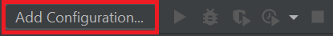

.. _api reference:

*************
API Reference
*************

Here we describe how you can:

- load data from a specific system
- implement an algorithm from another python package

This boils down to creating your own plugins and injecting them into the GUI.
In case you want to change something closer at the core of the GUI, you might need to take a look at our
:ref:`Contribution guidelines <contribution guidelines>`.
Before we start implementing our plugin, we explain in the first section how to set up PyCharm.

.. _configuring pycharm script:

1. Configuring PyCharm Script
#############################

.. note::
   Some basic steps need to be done beforehand, please check our :ref:`[Developer guidelines] <developer guidelines>` for that.

1.1 Creating an executable script
*********************************
Create a new project with a python file named `start_gui`.
Insert the following code:

.. code-block:: python

    from mad_gui import start_gui
    start_gui(data_dir=<put a directory here as string, e.g. "/home" or "C:/">)

.. _adding a script for execution:

1.2 Adding a script for execution
*********************************

Click `Add Configuration...` on the top right:

In the new window, click on the `+` smybol on the top left and select `Python`.
On the right hand side do the following:

=============================== =======
Field                           Content
=============================== =======
Name                            Start GUI
Script path                     <path to your_project/start_mad_gui>
Python Interpreter              Select the environment you created before
=============================== =======

You are done with configuration, click `OK` or `Apply`.
Where you saw `Add Configuration...` previously, should now be written `Start GUI`.
Next to it, you see the green play button, which will start the GUI.
The bug next to it can be used to start the debug mode.

.. _other systems:

2 Adding your plugins
#####################

2.1 Adding support for other systems
************************************

The GUI can be imported into your python project and then you can inject `Importers`, `Algorithms` (to be done), and `Exporters`.
Below we explain, how you can create and inject plugins for the GUI.

2.2.1 Exemplary Plugin
**********************
This describes how you can inject your plugin.
As an example, we show how to create a custom importer.

The GUI can be used to load data from different systems.
For each system, an `Importer` can be created.
Your `Importer` might make use of the methods already implemented in `BaseImporter`, which all Importers should inherit from, see :ref:`Plugins <plugins>`.

.. note::
   You do not have to implement all methods of `BaseImporter`, just the ones you need.
   In case you want to send a message to the user of the GUI, you can use this:

   .. code-block:: python

       from mad_gui.user_information import UserInformation
       UserInformation.ask_user("Your message")

Here you can see an example of how to create an Importer and how to inject it:

.. code-block:: python

    from typing import Tuple, Dict
    from mad_gui import start_gui, BaseImporter, BaseSettings

    class CustomImporter(BaseImporter):
        @classmethod
        def name(cls) -> str:
            # This will be shown as string in the dropdown menu of mad_gui.windows.LoadDataWindow upon
            # pressing the button "Load Data" in the GUI
            return "Custom importer"

        def load_sensor_data(self, file) -> Tuple[Dict, float]:
            # We creat a dictionary with one key for each plot we want to generate.
            # Each value of the dictionary is a pandas dataframe, with columns being the single data streams / sensor channels.
            # for more information see our Plugins section (link above this code snippet).
            data = <some method to load the data from file or relative to file>
            return {
                "left_sensor": data["left_foot"],
                "right_sensor": data["right_foot"],
            }, 204.8

    start_gui(
        data_dir=".", # you can also put a directory of your choice here, e.g. "/home" or "C:/"
        plugins=[CustomImporter],
    )

This created Importer can be accessed in the GUI by clicking the `Load Data` button, which in turn opens the
`LoadDataWindow`, see :ref:`Windows <windows>`.

If you want to also add algorithms which are executed upon pressing the buttons `Use algorithm` and `Export Data`,
please see the two sections below.

2.2.2 Implement an algorithm (`Use Algorithm` button)
*****************************************************
If you want to implement an algorithm to automatically create labels based on the displayed data,
you will have to additionally implement your custom loader's `annotation_from_data` method, see our `BaseImporter` in :ref:`Plugins <plugins>`.

2.2.3 Implement an exporter (`Export data` button)
**************************************************
This basically works as described in the previous section for an exemplary algorithm.
If you want to calculate and export parameters from the plotted data, you need to implement the BaseExporter's
`get_df_to_export` in your exporter.
Upon pressing the `Export data` button in the GUI, the `ExportDataWindow` (see :ref:`Windows <windows>`) will be opened,
in which your exporter can be selected.
After creating your exporter, make sure to also pass it to the `start_gui` function.