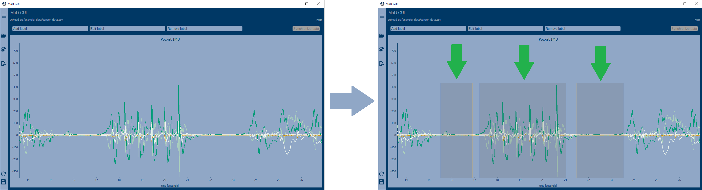
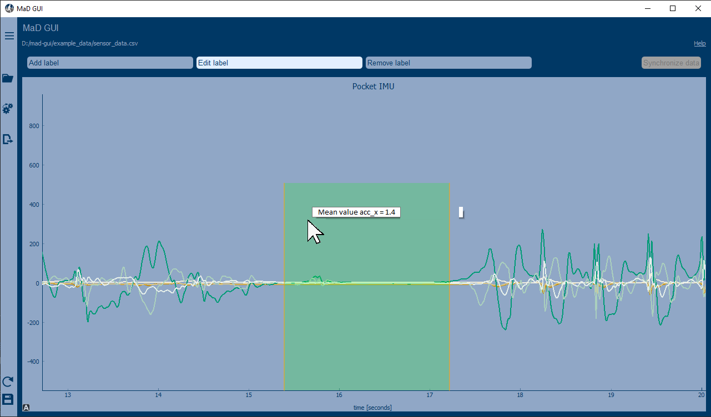

.. sectnum::

.. _customization:

***********
Development
***********

.. note::
   In case you are not familiar with PyCharm and virtual environments, you might first want to check out our
   :ref:`Developer guidelines <developer guidelines>`. However, if you want to get going quickly just install MaD GUI
   using `pip install mad_gui` or by adding it to your project's requirements.

Creating an executable script
*****************************

First of all, you need to create a python script with the code below.
This will enable you to start the GUI.

Insert the following code:

.. code-block:: python

    from mad_gui import start_gui
    start_gui(data_dir=<put a directory here as string, e.g. "/home" or "C:/">)

You can execute this script as described in our :ref:`Developer guidelines <adding a script for execution>`.

.. _other systems:

Adding your plugins
*******************

The GUI can be imported into your python project and then you can inject `Importers`, `Algorithms`, and
`Exporters`.
Below we explain, how you can create and inject such plugins to the GUI.
If - at any point - you want to send a message to the user of the GUI, you create a message box with an OK button like
this:

.. code-block:: python

   from mad_gui.user_information import UserInformation
   UserInformation.ask_user("Your message")

.. _implement importer:

Implement an importer
#####################
If the user presses the `Load data` button in the GUI, a `LoadDataWindow <https://github.com/mad-lab-fau/mad-gui/blob/main/mad_gui/components/dialogs/plugin_selection/load_data_dialog.py#L40>`_
will pop up, as shown in our `exemplary video about loading data <https://youtu.be/akxcuFOesC8>`_.
In there, the user can select one of the importers that were passed to the GUI at startup by selecting it in a dropdown.
The loader takes care for:

   * transforming data from your recording system to a dictionary using its :meth:`~mad_gui.plugins.BaseImporter.load_sensor_data`
   * optionally: loading annotations from a user format using its :meth:`~mad_gui.plugins.BaseImporter.load_annotations`

Your `Importer` must inherit from :class:`~mad_gui.plugins.BaseImporter`, as shown in the following example.
After creating your importer you have to pass it to the GUI, which is also shown in the example:

.. raw:: html

   

   
&#128104;&#8205;&#128187; Click to show/hide our exemplary code snippet.

.. code-block:: python

    from typing import Dict
    import pandas as pd
    from mad_gui import start_gui, BaseImporter

    class CustomImporter(BaseImporter):
        @classmethod
        def name(cls) -> str:
            # This will be shown as string in the dropdown menu of the LoadDataWindow upon
            # pressing the button "Load Data" in the GUI
            return "Custom importer"

        def load_sensor_data(self, file) -> Dict:
            # We create a dictionary with one key for each plot we want to generate.
            # Each value of the dictionary is a pandas dataframe,
            # with columns being the single data streams / sensor channels.
            data = {
            "IMU Hip": {
                "sensor_data": pd.read_csv(file)[['x', 'y', 'z']],
                "sampling_rate_hz": 50,
                # note: all other items will become part of the dictionary PlotData.additional_data,
                # This data it is not plotted, but is available for algorithms later on.
                "additional_data": Path(file).name
                }
            }

            return data

    start_gui(
        data_dir=".",
        plugins=[CustomImporter],
    )

.. raw:: html

   

.. _implement algorithm:

Implement an algorithm
######################
If the user presses the `Use algorithm` button in the GUI, a `PluginSelectionDialog <https://github.com/mad-lab-fau/mad-gui/blob/main/mad_gui/components/dialogs/plugin_selection/plugin_selection_dialog.py#L29>`_
will pop up, as shown in our `exemplary video about automated annotations <https://youtu.be/VWQKYRRRGVA?t=65>`_.
In there, the user can select one of the algorithms that were passed to the GUI at startup by selecting it in a dropdown.
The algorithm receives `Global Data <https://mad-gui.readthedocs.io/en/latest/modules/generated/mad_gui/mad_gui.models.GlobalData.html#mad_gui.models.GlobalData>`_'s
plot_data dictionary, where the keys are the plot names and the values are of type
`Plot Data <https://mad-gui.readthedocs.io/en/latest/modules/generated/mad_gui/mad_gui.models.local.PlotData.html#mad_gui.models.local.PlotData>`_.
Below we show you what that means and how you can use this data.

The general structure of your algorithm-class will look as shown below.
The content of `process_data`, however, depends on the exact use-case of the algorithm.
Two possible use-cases are explained in the subsections after this code snippet.

.. raw:: html

   

   
 &#128104;&#8205;&#128187; Click to show/hide our exemplary code snippet.

.. code-block:: python

    from typing import Dict
    import pandas as pd
    from mad_gui import start_gui, BaseAlgorithm
    from mad_gui.plot_tools.labels import BaseRegionLabel
    from mad_gui.models.local import PlotData
    from mad_gui.components.dialogs.user_information import UserInformation

    class CustomAlgorithm(BaseAlgorithm):
        @classmethod
        def name(cls):
            return "Find Resting Phases (example MaD GUI)"

        # The content of this method can be as described in the two sections Option A and Option B below
        def process_data(self, data: Dict[str, PlotData]) -> Dict[str, PlotData]:
            #####################################################################
            # ----> See the two sections below for content of this method <---- #
            #####################################################################

    # It is important to create the class Activity and pass it to the GUI because otherwise
    # the sensor_plot.annotation will not have a key `Activity` and thus won't know how to plot
    # the labels it receives from CustomAlgorithm.process_data via its process_data method
    class Activity(BaseRegionLabel):
        name = "Activity Label"
        min_height = 0
        max_height = 0.8

    start_gui(
        data_dir=".", # you can also put a directory of your choice here, e.g. "/home" or "C:/"
        plugins=[CustomAlgorithm],
        labels=[Activity]
    )

In this example we are using the label class `Activity`, however, you can also use custom labels.
If you want to read more about creating custom labels, see :ref:`below <custom labels>`.
If you want to see a full working example, head to `ExampleImporter <https://github.com/mad-lab-fau/mad-gui/blob/main/mad_gui/plugins/example.py#L29>`_.

.. raw:: html

   

.. _option_a:

Option A: Create labels to be plotted
^^^^^^^^^^^^^^^^^^^^^^^^^^^^^^^^^^^^^

Create labels which span a region between to samples given by your algorithm. After you return from `process_data`, the
GUI will plot the labels automatically for you, as shown in this image (click to zoom):

.. raw:: html

    
    

.. raw:: html

   

   
&#128104;&#8205;&#128187; Click to show/hide our exemplary code snippet.

.. note::

   This code snippet is to be inserted into your `CustomAlgorithm` as explained in :ref:`implement algorithm`.
   The labels you want to create (in this case `Activity`) must have been passed to the `start_gui` method on startup.

In the code snippet below, line 6 `sensor_plot.annotations["Activity"]` basically is a `pd.DataFrame`.
However, you can see an additional `.data` in the code. This is due to internal data handling in the GUI.
You do not need to care about that, just make sure that the method `self.create_annotations(...)`
returns a pd.DataFrame with the columns `start` and `end`.

.. code-block:: python
   :linenos:

    def process_data(self, data: Dict[str, PlotData]) -> Dict[str, PlotData]:
        for sensor_plot in data.values():
            # Use the currently plotted data to create labels, like an Activity Label
            annotations = self.create_annotations(sensor_plot.data, sensor_plot.sampling_rate_hz)
            UserInformation.inform(f"Found {len(annotations)} resting phases.")
            sensor_plot.annotations["Activity Label"].data = annotations

    @staticmethod
    def create_annotations(sensor_data: pd.DataFrame, sampling_rate_hz: float) -> pd.DataFrame:
        """Some code that creates a pd.DataFrame with the columns `start` and `end`.

        Each row corresponds to one label to be plotted.
        """
        # use some algorithm to find out where activities should start
        # like `running`
        starts = ...
        # ...and the same for ends of the activity
        ends = ...
        annotations = pd.DataFrame(data=[starts, ends], columns = ['start', 'end'])
        return annotations

.. raw:: html

   

.. _option_b:

Option B: Analyze data within existing labels
^^^^^^^^^^^^^^^^^^^^^^^^^^^^^^^^^^^^^^^^^^^^^

Create information about each existing label/annotation in the plot.
The existing labels maybe were plotted by an algorithm, as shown in :ref:`option a`, or maybe they were added manually
in the GUI by using the `Add label` mode.

To show some results for each of the annotations, you just need to put a string into each label's `description`, as
shown in the code snippet below.
The GUI will automatically take care for showing that string when the user hovers over a label, as shown in this image
(click to zoom):

.. raw:: html

    
    

.. raw:: html

   

   
&#128104;&#8205;&#128187; Click to show/hide our exemplary code snippet.

.. note::

   This code snippet is to be inserted into your `CustomAlgorithm` as explained in :ref:`implement algorithm`.

.. code-block:: python

   from mad_gui.components.dialogs import UserInformation

   def process_data(self, data: Dict[str, PlotData]) -> Dict[str, PlotData]:
      for sensor_plot in data.values():
          if len(sensor_plot.annotations["Activity"]) == 0:
            UserInformation.inform("There are no labels in the plot, therefor nothing is analyzed")
          for i_activity, activity in sensor_plot.annotations["Activity"].data.iterrows():
              # use some method to calculate features for each labelled activity
              # the resulting string will be the activity label's tool tip,
              # so it can be seen by the user by hovering over the label with the mouse
              sensor_plot.annotations["Activity"].data.at[
                  i_activity, 'description'
              ] = self.calculate_features(sensor_plot.data.iloc[activity.start:activity.end],
                                          sensor_plot.sampling_rate_hz
                                         )

   @staticmethod
   def calculate_features(sensor_data: pd.DataFrame, fs: sampling_rate_hz) -> str:
      # here you can for example use an algorithm to calculate features of the data.
      # you can also inform the user about things you like using a pop-up window:
      UserInformation.inform(f"Calculating a feature for data between the samples"
                             f" {sensor_data.index.iloc[0]} and"
                             f" {sensor_data.index.iloc[-1]}")
      return f"Mean value acc_x = {sensor_data['acc_x'].mean()}"

.. raw:: html

   

Implement an exporter
#####################
This basically works as described in the section of creating an importer.
Upon pressing the `Export data` button in the GUI, the `ExportResultsDialog <https://github.com/mad-lab-fau/mad-gui/blob/main/mad_gui/components/dialogs/plugin_selection/export_results_dialog.py#L19>`_ will be
opened, in which your exporter can be selected. Basically, you will receive a `GlobalData <https://mad-gui.readthedocs.io/en/latest/modules/generated/mad_gui/mad_gui.models.GlobalData.html#mad_gui.models.GlobalData>`_ object, which keeps
all the data form the GUI and you can process / export it in whatever way you want:

.. raw:: html

   

   
&#128104;&#8205;&#128187; Click to show/hide our exemplary code snippet.

.. code-block:: python

    from typing import Tuple, Dict
    from mad_gui import start_gui, BaseExporter, BaseSettings

    class CustomExporter(BaseImporter):
        @classmethod
        def name(cls) -> str:
            # This will be shown as string in the dropdown menu of mad_gui.components.dialogs.ExportResultsDialog upon
            # pressing the button "Export data" in the GUI
            return "Custom exporter"

        def process_data(global_data):
            # Here you can do whatever you like with our global data.
            # See the API Reference for more information about our GlobalData object

After creating your exporter, make sure to also pass it to the `start_gui` function.

.. raw:: html

   

Setting a Theme
***************

You can easily change the two dominating colors by passing your own theme to the GUI.

.. raw:: html

   

   
&#128104;&#8205;&#128187; Click to show/hide our exemplary code snippet.

.. code-block:: python

   from mad_gui.config import BaseTheme
   from PySide2.QtGui import QColor

   class MyTheme(BaseTheme):
      COLOR_DARK = QColor(0, 56, 101)
      COLOR_LIGHT = QColor(144, 167, 198)

   start_gui(
    theme=MyTheme,
   )

.. raw:: html

   

.. _setting constants:

Setting Constants
*****************

You can create your own settings by creating a class, which inherits from our `BaseSettings <https://github.com/mad-lab-fau/mad-gui/blob/main/mad_gui/config/settings.py#L1>`_.
The following example makes use of the BaseSettings and simply overrides some properties:

.. raw:: html

   

   
&#128104;&#8205;&#128187; Click to show/hide our exemplary code snippet.

.. code-block:: python

   from mad_gui.config import BaseSettings

   class MySettings(BaseSettings):
     CHANNELS_TO_PLOT = ["acc_x", "acc_z"]

     # used if a label has `snap_to_min = True` or `snap_to_max = True`
     SNAP_AXIS = "acc_x"
     SNAP_RANGE_S = 0.2

     # in all your labels you can add an event by using `Ctrl` as modifier when in `Add label` mode
     # when adding an event the user will be prompted to select one of these two strings as a `description` for the event
     EVENTS = ["important event", "other type of important event"]

     # Set the width of IMU plot to this, when hitting the play button for the video.
     PLOT_WIDTH_PLAYING_VIDEO = 20  # in seconds

     # If plotting large datasets, this speeds up plotting, however might result in inaccurate representation of the data
     AUTO_DOWNSAMPLE = True

   start_gui(
    settings=MySettings,
   )

.. raw:: html

   

.. _custom labels:

Creating custom labels
**********************
You can create labels and pass them to our GUI.
Your label must inherit form our `BaseRegionLabel <https://mad-gui.readthedocs.io/en/latest/modules/generated/plot_tools/mad_gui.plot_tools.labels.BaseRegionLabel.html#mad_gui.plot_tools.labels.BaseRegionLabel>`_.
It could for example look like this:

.. raw:: html

   

   
&#128104;&#8205;&#128187; Click to show/hide our exemplary code snippet.

.. code-block:: python

   from mad_gui.plot_tools.base_label import BaseRegionLabel
   from mad_gui import start_gui

   class Status(BaseRegionLabel):
      # This label will always be shown at the lowest 20% of the plot view
      min_height = 0
      max_height = 0.2
      name = "Anomaly Label"

      # Snapping will be done on the axis and in the range defined in MySettings (see above)
      snap_to_min = True
      # snap_to_max = False  # if setting this to `True`, set `snap_to_min` to `False` or delete it

      # User will be asked to set the label's description when creating a label.
      # This can have an arbitrary amount of levels with nested dictionaries.
      descriptions = {"normal": None, "anomaly": ["too fast", "too slow"]}

   start_gui(labels=[Status])

The `description` defines the possible strings that can be assigned to a label. They will automatically show up after
adding a new label or by clicking on a label when in `Edit label` mode, such that the user can select one of the
descriptions. In our `exemplary video <https://www.youtube.com/watch?v=VWQKYRRRGVA&t=18s>`_, this is
`{"stand": None, "walk": ["fast", "slow"], "jump": None}`.

.. raw:: html

   

