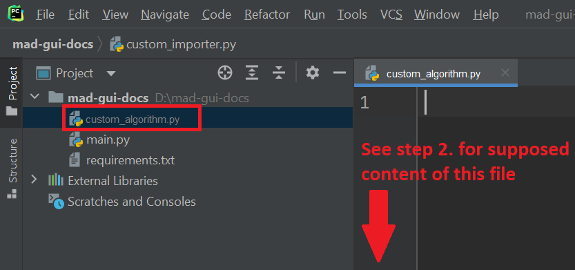

.. sectnum::

.. _customization:

***********
Development
***********

.. note::
   In case you experience issues, please try to find a solution in :ref:`Troubleshooting for Developers <troubleshooting development>`.

About plugins (IMPORTANT)
*************************

You can create your own plugins as we describe it on this page.
The GUI supports three categories of plugins:

   - :ref:`implement importer`
   - :ref:`implement algorithm`
   - :ref:`implement exporter`

Your plugin will receive data from our GUI at runtime, e.g. when your plugin was selected to load data or when it was
selected as an algorithm.

If you want to use the specific plugin in the GUI, **you have to pass that plugin to our `start_gui` function**:

.. code-block:: python

    from mad_gui import start_gui
    start_gui(plugins=[MyFirstPlugin, MySecondPlugin])

You can execute the above code as a script as described in our section :ref:`Prepare Development <adding a script for execution>`.

.. _other systems:

Adding plugins
**************

Below we explain, how you can create and inject plugins to the GUI.
There is always a list that describes the single steps.
For each step, the **details are shown as soon as you click on
the respective item in the list**.
All plugins are based on our base classes of algorithms, for which you can find the documentation `here <https://mad-gui.readthedocs.io/en/latest/modules/plugins.html>`_.

.. _implement importer:

Plugin: Load and display data of a specific system
##################################################

You will have to create a plugin, an importer, which inherits from our `BaseImporter <https://mad-gui.readthedocs.io/en/latest/modules/generated/plugins/mad_gui.plugins.BaseImporter.html>`_.
It enables our GUI to load your specific type of data.
If you perform the steps from the list below **(click to unfold/fold the sections to see details)**, your importer will
be included into the GUI as shown in `this GIF <_static/gifs/importer.gif>`_
(no need to get everything from the GIF, details are in the list below).

.. raw:: html

   

   
1. Create a file that will include your custom importer (click to show image)

.. image:: _static/images/development/importer_create_file.png
    :alt: Creating a file for the plugin

.. raw:: html

   

.. raw:: html

   

   
2. Develop your custom importer in that file, as shown in this code snippet (click to show code)

.. code-block:: python

   """These are the contents of custom_importer.py, which holds my first importer."""

   from typing import Dict
   import pandas as pd
   from mad_gui import start_gui, BaseImporter

   class CustomImporter(BaseImporter):
     @classmethod
     def name(cls) -> str:
         ################################################
         ###                   README                 ###
         ### Set your importer's name as return value ###
         ### This name will show up in the dropdown.   ###
         ################################################
         return "My Importer"

     def load_sensor_data(self, file_path: str) -> Dict:
         ##################################################################
         ###                       README                               ###
         ### a) Use the argument `file_path` to load data. Transform    ###
         ###    it to a pandas dataframe (columns are sensor channels). ###
         ###    Assign it to sensor_data.                               ###
         ###                                                            ###
         ### b) load the sampling rate (int or float)                   ###
         ##################################################################
         sensor_data =
         sampling_rate =

         # CAUTION: if you only want to have one plot you do not need to
         # change the following lines!
         # If you want several plots, just add another sensor like "IMU foot"
         # to the `data` dictionary.
         data = {
         "IMU Hip": {
             "sensor_data": sensor_data,
             "sampling_rate_hz": sampling_rate,
             }
         }

         return data

.. raw:: html

   

.. raw:: html

   

   
 3. Pass the developed importer class to the `start_gui` function (click to show code and image)

.. code-block:: python

   from mad_gui import start_gui
   from custom_importer import CustomImporter

   start_gui(plugins=[CustomImporter])

.. image:: _static/images/development/importer_pass_to_gui.png
    :alt: Making the plugin available in the GUI

.. raw:: html

   

    

After you have performed the steps from the above list, you can select the importer in the GUI by pressing `Load Data`
and then selecting it in the dropdown on the upper left in the pop-up window.
From user perspective it should work as we have described in our
`exemplary video about loading data <https://youtu.be/akxcuFOesC8?t=10>`_.

If the user presses `Start processing`, the path to the selected file will be passed to the selected loader's
`load_sensor_data` method, as shown in `the GIF <_static/gifs/importer.gif>`_.
After returning the dictionary from this method to the GUI, the GUI will plot the data.

.. note::
    In case loading your file does not work, we recommend to set breakpoints into your loader and check, whether
    everything does what you expect it to do. Also you might want to look at our section about
    :ref:`Troubleshooting development <troubleshooting development>` or at
    `load_sensor_data's documentation <https://mad-gui.readthedocs.io/en/latest/modules/generated/plugins/mad_gui.plugins.BaseImporter.html#mad_gui.plugins.BaseImporter.load_sensor_data>`_.

.. _implement algorithm:

Plugin: Calculate features for existing annotations or create new annotations
#############################################################################

You will have to create a plugin, an algorithm, which inherits from our `BaseAlgorithm <https://mad-gui.readthedocs.io/en/latest/modules/generated/plugins/mad_gui.plugins.BaseAlgorithm.html#mad_gui.plugins.BaseAlgorithm>`_.
The user can then select it after pressing the `Use algorithm` button in the GUI, as shown in our
`exemplary video about automated annotations <https://youtu.be/VWQKYRRRGVA?t=65>`_.

The basic implementation of an algorithm is explained in this section.
In the list below you can see the necessary steps **(click to unfold/fold the sections to see details)**.

.. raw:: html

   

   
1. Create a file that will include your custom algorithm (click to show image)

.. raw:: html

   

.. raw:: html

   

   
2. Develop your custom algorithm in that file, as shown in this code snippet (click to show code)

.. code-block:: python

    """This is the content of custom_algorithm.py, which holds my first algorithm plugin."

    from typing import Dict
    import pandas as pd
    from mad_gui import start_gui, BaseAlgorithm
    from mad_gui.plot_tools.labels import BaseRegionLabel
    from mad_gui.models.local import PlotData
    from mad_gui.components.dialogs.user_information import UserInformation

    class CustomAlgorithm(BaseAlgorithm):
        @classmethod
        def name(cls):
            ###################################################################
            ### This is the string that will show up in the GUI's dropdown, ###
            ###        after pressing the `Use algorithm` button.           ###
            ###################################################################
            return "Find Resting Phases (example MaD GUI)"

        # The content of this method can be as described in the two sections Option A and Option B below
        def process_data(self, data: Dict[str, PlotData]) -> Dict[str, PlotData]:
            #######################################################################
            # ----> See sectionx 3, 3.1, and 3.2 for content of this method <---- #
            #######################################################################

When you have put this code into `custom_algorithm.py`, go on with the next sections to see what code needs to go into
`process_data`.
If you want to know more about the data type `Plot Data`, please refer to
`the regarding documentation <https://mad-gui.readthedocs.io/en/latest/modules/generated/mad_gui/mad_gui.models.local.PlotData.html#mad_gui.models.local.PlotData>`_.

.. raw:: html

   

.. raw:: html

   

   
3. Fill the method `process_data` with content (either 3.1 or 3.2)

The code snippet from 2. is not complete. Depending on whether you want your algorithm to calculate
features from existing annotations or to create annotations for the plotted data, the content of your plugin's `process_data`
will be as descrbied in one of the following two subsections 3.1 and 3.2.

.. raw:: html

   

.. raw:: html

   

   
3.1 Calculate features for existing annotations (click to show code)

.. _option a:

.. note::

   This code snippet is to be inserted into your `CustomAlgorithm` as explained in 3.

This assumes, there are already annotations in the GUI, as shown in `this GIF <_static/gifs/algorithm_feature.gif>`_.
The existing annotations may have been plotted by an algorithm, or may have been added manually in the GUI by using the
`Add label` mode, both examples are shown in our `exemplary video about annotations <https://youtu.be/VWQKYRRRGVA">`_.

Using this custom algorithm, you can create information about each existing annotation in the plot.
The GUI will take care for showing the results as soon as the user hovers of the annotation with the mouse, as
you can see in the GIF we linked above.

You just need to put a string into each annotation's `description`, as shown in the code snippet below:

.. code-block:: python

   def process_data(self, data: Dict[str, PlotData]) -> Dict[str, PlotData]:
      for sensor_plot in data.values():
          if len(sensor_plot.annotations["Exemplary Label"]) == 0:
            UserInformation.inform("There are no annotations in the plot, therefore nothing is analyzed")
          for i_activity, activity in sensor_plot.annotations["Exemplary Label"].data.iterrows():
               ###################################################################
               ###                               README                        ###
               ###  You can change the kind of annotation to use by changing   ###
               ### "Exemplary Label" to something else. Note, that this should ###
               ###  be a string that is returned  by one of the labels' name() ###
               ###  method which were passed to `start_gui`.                   ###
               ###################################################################
              sensor_plot.annotations["Exemplary Label"].data.at[
                  i_activity, 'description'
              ] = self.calculate_features(sensor_plot.data.iloc[activity.start:activity.end],
                                          sensor_plot.sampling_rate_hz
                                         )
         UserInformation.inform("Algorithm executed. Move the mouse over a label to see the result in a pop-up.")

   @staticmethod
   def calculate_features(sensor_data: pd.DataFrame, fs: sampling_rate_hz) -> str:
      ##############################################################################
      ###                               README                                   ###
      ###    Here you can use a more complex algorithm to calculate features.    ###
      ###   Please format your algorithm's results as a string and return it.    ###
      ##############################################################################
      return f"Mean value acc_x = {sensor_data['acc_x'].mean()}"

.. raw:: html

   

.. raw:: html

   

   
3.2 Create annotations to be plotted (click to show code)

.. _option b:

.. note::

   This code snippet is to be inserted into your `CustomAlgorithm` as explained in 3.

A plugin like this can be used to create annotations which span a region between to samples given by your algorithm.
After returning from `process_data`, the GUI will plot the annotations automatically for you, as shown in
`this GIF <_static/gifs/algorithm_label.gif>`_.

In the code snippet below, line 6 `sensor_plot.annotations["Exemplary Label"]` basically is a `pd.DataFrame`.
However, you can see an additional `.data` in the code. This is due to internal data handling in the GUI.
You do not need to care about that, just make sure that the method `self.create_annotations(...)`
returns a pd.DataFrame with the columns `start` and `end`.

.. code-block:: python
   :linenos:

    def process_data(self, data: Dict[str, PlotData]) -> Dict[str, PlotData]:
        for plot_name, sensor_plot in data.items():
            # Use the currently plotted data to create annotations, like an MyLabel Label
            annotations = self.create_annotations(sensor_plot.data, sensor_plot.sampling_rate_hz)
            UserInformation.inform(f"Found {len(annotations)} for {plot_name}.")
            sensor_plot.annotations["Exemplary Label"].data = annotations

    @staticmethod
    def create_annotations(sensor_data: pd.DataFrame, sampling_rate_hz: float) -> pd.DataFrame:
        """Some code that creates a pd.DataFrame with the columns `start` and `end`.

        Each row corresponds to one annotation to be plotted.
        """
        # use some algorithm to find out where activities should start
        # like `running`
        starts = ...
        # ...and the same for ends of the activity
        ends = ...
        annotations = pd.DataFrame(data=[starts, ends], columns = ['start', 'end'])
        return annotations

.. raw:: html

   

.. raw:: html

   

   
4. Pass algorithm and label class to GUI (click to show code)

In the examples from 3.1/3.2 we are using the label class `MyLabel.name()`, which is "Exemplary Label".
This must have been passed to `start_gui`, otherwise the algorithm won't work.
Also you have to pass the algorithm itself to the GUI:

.. code-block:: python

   from custom_algorithm import CustomAlgorithm
   from mad_gui import start_gui

    class MyLabel(BaseRegionLabel):
        name = "Exemplary Label"
        min_height = 0
        max_height = 1

    start_gui(plugins=[MyAlgorithm], labels=[MyLabel])

However, you can also use other custom labels.
All necessary information about custom labels, should be available in :ref:`custom labels`.

.. _implement exporter:

Plugin: Export displayed annotations
####################################

This basically works as described in the section of creating an importer.
Upon pressing the `Export data` button in the GUI, the `ExportResultsDialog <https://github.com/mad-lab-fau/mad-gui/blob/main/mad_gui/components/dialogs/plugin_selection/export_results_dialog.py#L19>`_ will be
opened, in which your exporter can be selected. Basically, you will receive a `GlobalData <https://mad-gui.readthedocs.io/en/latest/modules/generated/mad_gui/mad_gui.models.GlobalData.html#mad_gui.models.GlobalData>`_ object, which keeps
all the data form the GUI and you can process / export it in whatever way you want:

.. code-block:: python

    from typing import Tuple, Dict
    from mad_gui import start_gui, BaseExporter, BaseSettings

    class CustomExporter(BaseImporter):
        @classmethod
        def name(cls) -> str:
            # This will be shown as string in the dropdown menu of
            # mad_gui.components.dialogs.ExportResultsDialog upon pressing
            # the button "Export data" in the GUI
            return "Custom exporter"

        def process_data(global_data):
            # Here you can do whatever you like with our global data.
            # See the API Reference for more information about our GlobalData object

After creating your exporter, make sure to also pass it to the `start_gui` function.

.. _custom labels:

Creating custom labels
**********************
You can create labels and pass them to our GUI.
Your label must inherit form our `BaseRegionLabel <https://mad-gui.readthedocs.io/en/latest/modules/generated/plot_tools/mad_gui.plot_tools.labels.BaseRegionLabel.html#mad_gui.plot_tools.labels.BaseRegionLabel>`_.
It could for example look like this:

.. code-block:: python

   from mad_gui.plot_tools.base_label import BaseRegionLabel
   from mad_gui import start_gui

   class Status(BaseRegionLabel):
      # This label will always be shown at the lowest 20% of the plot view
      min_height = 0
      max_height = 0.2
      name = "Anomaly Label"

      # Snapping will be done on the axis and in the range defined in MySettings (see above)
      snap_to_min = True
      # snap_to_max = False  # if setting this to `True`, set `snap_to_min` to `False` or delete it

      # User will be asked to set the label's description when creating a label.
      # This can have an arbitrary amount of levels with nested dictionaries.
      descriptions = {"normal": None, "anomaly": ["too fast", "too slow"]}

   start_gui(labels=[Status])

The `description` defines the possible strings that can be assigned to a label. They will automatically show up after
adding a new label or by clicking on a label when in `Edit label` mode, such that the user can select one of the
descriptions. In our `exemplary video <https://www.youtube.com/watch?v=VWQKYRRRGVA&t=18s>`_, this is
`{"stand": None, "walk": ["fast", "slow"], "jump": None}`.

Send a message to the user
**************************

If - at any point - you want to send a message to the user of the GUI, you create a message box with an OK button like
this:

.. code-block:: python

   from mad_gui.user_information import UserInformation
   UserInformation.inform_user("Your message")
   yes_no = UserInformation().ask_user("Yes or No?") # will return from PySide2.QtWidgets.QMessageBox.Yes
                                                     # or from PySide2.QtWidgets.QMessageBox.No

Setting a Theme
***************

You can easily change the two dominating colors by passing your own theme to the GUI.

.. code-block:: python

   from mad_gui.config import BaseTheme
   from PySide2.QtGui import QColor

   class MyTheme(BaseTheme):
      COLOR_DARK = QColor(0, 56, 101)
      COLOR_LIGHT = QColor(144, 167, 198)

   start_gui(
    theme=MyTheme,
   )

.. _setting constants:

Setting Constants
*****************

You can create your own settings by creating a class, which inherits from our `BaseSettings <https://github.com/mad-lab-fau/mad-gui/blob/main/mad_gui/config/settings.py#L1>`_.
The following example makes use of the BaseSettings and simply overrides some properties:

.. code-block:: python

   from mad_gui.config import BaseSettings

   class MySettings(BaseSettings):
     CHANNELS_TO_PLOT = ["acc_x", "acc_z"]

     # used if a label has `snap_to_min = True` or `snap_to_max = True`
     SNAP_AXIS = "acc_x"
     SNAP_RANGE_S = 0.2

     # in all your labels you can add an event by using `Ctrl` as modifier when in `Add label` mode
     # when adding an event the user will be prompted to select one of these two strings as a
     # `description` for the event
     EVENTS = ["important event", "other type of important event"]

     # Set the width of IMU plot to this, when hitting the play button for the video.
     PLOT_WIDTH_PLAYING_VIDEO = 20  # in seconds

     # If plotting large datasets, this speeds up plotting, however might result in inaccurate
     # representation of the data
     AUTO_DOWNSAMPLE = True

   start_gui(
    settings=MySettings,
   )
