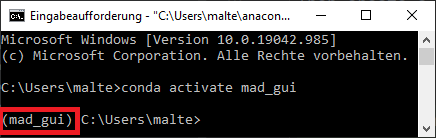
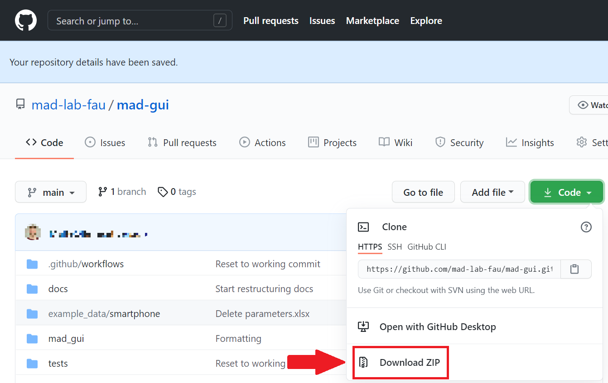

.. _developer guidelines:

********************
Developer Guidelines
********************

In the first four sections we give some information about the project setup.
If you are familiar with PyCharm and python virtual environments, you may directly jump to :ref:`Adapting the GUI <adapting the gui>`.

.. _installing software:

Installing necessary software
#############################
Necessary software to be installed in advance:

    - `anaconda <https://www.anaconda.com/products/individual>`_
    - `PyCharm <https://www.jetbrains.com/pycharm/>`_

Anaconda will be used to create a python virtual environment into which all dependencies of the GUI are going to be installed.
This virtual environment will then be used as python interpreter in the PyCharm IDE to develop the GUI.

.. _preparing environment:

Preparing an environment
########################
After installing anaconda, open the Anaconda Prompt.
Then create a virtual environment in there by using the following commands:

.. code-block:: console

    conda create -n mad_gui python=3.7 --no-default-packages
    conda activate mad_gui

If the environment is activated you can see `(mad_gui)` in the commandline before your next input.

Installing MaD GUI
##################

You have two possibilities for installing the dependencies:

Recommended: Assuming you want to build on top of the MaD GUI and do things that are described in :ref:`customization`, installation
can be done as described in :ref:`Installation for Customization (recommended) <install via pip>`.

In case you want to change parts at the core of the GUI, which go beyond the parts described in :ref:`customization`,
you should use poetry as described in :ref:`Installation for Contributing <install via poetry>`

.. _install via pip:

1. Installation for Customization (recommended)
***********************************************

Make sure `mad_gui` virtual environment is still activated (see :ref:`Preparing environment <preparing environment>`).
Depending on how you are handling dependency management, you can use one of the three suggestions:

   * No dependency management: `pip install mad_gui`
   * Using requirements.txt: add `mad_gui` and then `pip install -r requirements.txt`
   * Using poetry: `poetry add mad_gui`

Make sure to include the underscore!
Otherwise, you will be installing something else.

.. _install via poetry:

2. Installation for Contributing
********************************

2.1 Retrieving the repository
*****************************
If you are familiar with git, simply clone the repository:

`git clone https://github.com/mad-lab-fau/mad-gui.git`

If you are not familiar with git, go to the start page of the repository, click the download button and then chose `zip` as shown in this image.
Afterwards, extract the contents from the zip file.

2.2 Actual installation
***********************
Stay in the anaconda prompt and switch to the directory, where you have downloaded the repository to.
Most likely, you will need commands like these:

.. code-block:: console

    cd ..  # to go to a parent directory
    cd folder_name  # to enter a folder
    dir  # (Windows) to list all files/folders in the current working directory
    ls  # (Unix) to list all files/folders in the current working directory

As soon as you have navigated to the repository's folder and you can see files like `pyproject.toml`, the installation can start.
Therefore, you first need to set up poetry.
Setting up `poetry` with `conda` as the main Python version can be a little tricky.
First, make sure that you installed poetry in the `recommended way <https://python-poetry.org/docs/#installation>`_ using
the PowerShell command.

Then you have 2 options to start using poetry for this package:

1. Using a `conda env` instead of `venv`

   .. code-block:: console

      echo Installing dependencies
      echo Poetry will `detect that you are already using a conda env <https://github.com/python-poetry/poetry/pull/1432>`_ and will use it, instead of creating a new one.
      poetry install --no-root`

After running the poetry install command you should be able to use poetry without activating the conda env again.
You just have to set up your IDE to use the conda env you created (see next section).

2. Using `conda` python and a `venv`
    - This only works, if your conda **base** env has a Python version supported by the project (>= 3.7)
    - Activate the base env
    - Run `poetry install --no-root`. Poetry will create a new venv in the folder `.venv`, because it detects and handles the conda base env
      `different than other envs <https://github.com/maksbotan/poetry/blob/b1058fc2304ea3e2377af357264abd0e1a791a6a/poetry/utils/env.py#L295>`_.
    - Everything else should work like you are not using conda

.. _Configuring PyCharm:

Configuring PyCharm
###################

You can either configure the python interpreter in pycharm directly while creating the project, or afterwards.
Both options are described below.

Option A: When setting up the project
*************************************

Open PyCharm and create a new project.
On the left hand side, select `Pure Python`.
On the right hand side:

   #. Set the location to a path where you want to keep the project.

   #. Unfold the element `Python Interpreter`

   #. Select `Previously configured interpreter` and click on the three dots on the very right

   #. On the left hand side select `Conda Environment`

   #. On the right hand side select the environment you have created before. By default, the environment should be located in:

      * Windows: C:/Users/<your user name>/anaconda3/envs/mad_gui/python

      * Unix: home/<user>/anaconda3/envs/mad_gui/python

Option B: After setting up the project
**************************************
In your opened project, do the following steps:

   #. File -> Settings -> Project: <your project name> -> Python Interpreter

   #. Click the wheel on the top right and then `Add...`

   #. On the left hand side select `Conda Environment`

   #. On the right hand side choose the radio button `Existing environment`

   #. Select the `python` of the environment you created, by default it should be here:

      * Windows: `C:/<user>/anaconda3/envs/mad_gui/python`

      * Unix: `home/<user>/anaconda3/envs/mad_gui/python`

.. _adding a script for execution:

Run a script in PyCharm
#######################

.. image:: _static/images/pycharm_01_add_config.png
    :width: 200
    :alt: Configure PyCharm
    :class: float-right

Click `Add Configuration...` on the top right:

In the new window, click on the `+` smybol on the top left and select `Python`.
On the right hand side do the following:

=============================== =======
Field                           Content
=============================== =======
Name                            Start GUI
Script path                     <path to the repository on your machine/start_gui.py>
Python Interpreter              Select the environment you created before
=============================== =======

You are done with configuration, click `OK` or `Apply`.
Where you saw `Add Configuration...` previously, should now be written `Start GUI`.
Next to it, you see the green play button, which will start the GUI.
The bug next to it can be used to start the debug mode.

Creating an executable
######################

You may want to ship the GUI including your plugin(s) to users, who are not familiar with python and/or do not have the possibilites to install something on their machine.
In this case, you can create an executable of the GUI as shown below.
In case you experience issues, it might be helpful to install a clean python 3.7 from which you create the venv.

.. code-block:: console

    echo navigating to the gui's repository
    cd mad_gui

    echo create virutal environment (make sure your python is 3.7)
    python -m venv .venv
    echo this creates the virutal environment in the folder `.venv`
    echo the `doit` task `prepare_windows_build` will make use of this folder by default later in this process

    echo activate the virutal environment 
    echo WINDOWS
    .venv/Scripts/activate
    echo UNIX, make sure to include the extra dot and space in the front!
    . .venv/bin/activate

    echo Install project dependencies
    echo in case pip install gets stuck at 'processing', see our troubleshooting section for a possible solution.
    pip install .

    echo get PyInstaller (make sure pyinstaller is NOT installed in your global python!)
    pip install pyinstaller

    echo we need this to perform the following task
    pip install doit
    
    echo for pyinstaller to be able to transform from png to jpg (if we use png directly, we get strange pink borders)
    pip install pillow

    echo we have to transform some .ui files to .py and put them into our .venv mad-gui library
    echo note: if you did not name your virtual environment .venv in the second step, you can pass the name using `-v <name of venv>`
    doit prepare_windows_build

    echo actually create the executable
    pyinstaller pyinstaller.spec --onefile

Afterwards, you will find the file in the `dist` folder.
Sometimes pyinstaller does not find all the imports. In that case, you might need to make use of its
`hidden import <https://pyinstaller.readthedocs.io/en/stable/when-things-go-wrong.html#listing-hidden-imports>`_
option.

.. _adapting the gui:

Adapting the GUI
################
We created the GUI in a way, that you can inject your own plugins into the GUI.
These can then for example take care for loading data of a specific format.
Furthermore, you have the possibility to inject algorithms this way.
If you want to do that, you will need our section about :ref:`Customization <customization>`.

In case you is something that you want to change in the GUI, which is not possible using the described ways for customization,
you will need our :ref:`Contribution Guidelines <contribution guidelines>`.

