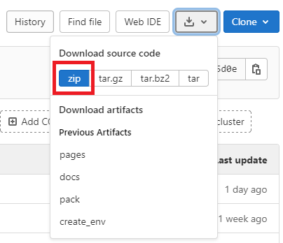

.. _developer guidelines:

********************
Developer Guidelines
********************

1. Installation
###############

Necessary software to be installed in advance:

    - `anaconda <https://www.anaconda.com/products/individual>`_
    - `PyCharm <https://www.jetbrains.com/pycharm/>`_

Anaconda will be used to create a python virtual environment into which all dependencies of the GUI are going to be installed.
This virtual environment will then be used as python interpreter in the PyCharm IDE to develop the GUI.

1.1 Retrieving the repository
*****************************
If you are familiar with git, simply clone the repository:

```
git clone https://github.com/mad-lab-fau/mad-gui.git
```
If you are not familiar with git, go to the start page of the repository, click the download button and then chose `zip` as shown in this image.
Afterwards, extract the contents from the zip file.



1.2 Preparing an environment
****************************
Open the Anaconda Prompt, which you have installed previously.
Then create a virtual environment in there by using the following commands:

.. code-block:: python

    conda create -n mad_gui python=3.7 --no-default-packages
    conda activate mad_gui

If the environment is activated you can see `(mad_gui)` in the commandline before your next input.

.. image:: res/images/conda_activated.png
    :width: 400
    :alt: Environment "mad_gui" activated in command prompt

Stay in the anaconda prompt and switch to the directory, where you have downloaded the repository to.
Most likely, you will need commands like these:

.. code-block::

    cd ..  # to go to a parent directory
    cd folder_name  # to enter a folder
    dir  # (Windows) to list all files/folders in the current working directory
    ls  # (Unix) to list all files/folders in the current working directory

As soon as you have navigated to the repository's folder and you can see files like `pyproject.toml`, the installation can start.
To do so, you need to perform either step 1.3.1 or step 1.3.2 to install the the MaD GUI.

1.3 Installation
****************
You have two possibilities for installing the dependencies:
using `pip <https://pip.pypa.io/en/stable/installing/>`_ or using `poetry <https://python-poetry.org>`_.
Using `pip` is easier and we suggest to use this if you want to get going quickly.
However, no proper dependency handling is ensured.
So if using `pip` causes problems regarding dependencies, you should switch to using `poetry`.

1.3.1 Using pip
***************
.. note::
    This approach might result in dependency conflicts. If those arise, you should use use poetry as described in the next section.

In the anaconda command prompt type (make sure `mad_gui` is still activated):

.. code-block::

    pip install .

Make sure to include the space and the dot.
If you have done this, you close the anaconda prompt. You can skip 1.3.2 and directly go on with :ref:`Configuring PyCharm`.

1.3.2 Using Poetry
*****************************
Setting up `poetry` with `conda` as the main Python version can be a little tricky.
First, make sure that you installed poetry in the `recommended way <https://python-poetry.org/docs/#installation>`_ using
the PowerShell command.

Then you have 2 options to start using poetry for this package:

1. Using a `conda env` instead of `venv`

.. code-block:: python

    # Install dependencies
    # Poetry will `detect that you are already using a conda env <https://github.com/python-poetry/poetry/pull/1432>`_ and will use it, instead of creating a new one.
    poetry install --no-root`

After running the poetry install command you should be able to use poetry without activating the conda env again.
You just have to set up your IDE to use the conda env you created (see next section).

2. Using `conda` python and a `venv`
    - This only works, if your conda **base** env has a Python version supported by the project (>= 3.7)
    - Activate the base env
    - Run `poetry install --no-root`. Poetry will create a new venv in the folder `.venv`, because it detects and handles the conda base env
      `different than other envs <https://github.com/maksbotan/poetry/blob/b1058fc2304ea3e2377af357264abd0e1a791a6a/poetry/utils/env.py#L295>`_.
    - Everything else should work like you are not using conda

.. _Configuring PyCharm:

1.4 Configuring PyCharm
***********************

1.4.1 Adding virtual environment to PyCharm
*******************************************
For now, you do not need the anaconda prompt any more and you can close it.

Next, you need to add your virtual environment to PyCharm:

   - File -> Settings -> Project: <your project name> -> Python Interpreter
   - Click the wheel on the top right and then `Add...`
   - On the left hand side select `Conda Environment`
   - On the right hand side choose the radio button `Existing environment`
   - Select the `python.exe` of the environment you created, by default it should be here:
      - Unix: `home/<user>/anaconda3/envs/mad_gui/python.exe`
      - Windows: `C:/<user>/anaconda3/envs/mad_gui/python.exe`


You can now choose if you want to want to extend it with plugins (recommended) or if you want change the GUI itself.

2 Adapting the GUI
##################
We created the GUI in a way, that you can inject your own plugins into the GUI.
These can then for example take care for loading data of a specific format.
Furthermore, you have the possibility to inject algorithms this way.
If you want to do that, you will need our :ref:`API Reference <api reference>`.

In case you experience anything that you wish the GUI should handle differently you want to change something,
which as not achievable via the plugins, you will need our :ref:`Contribution Guidelines <contribution guidelines>`.


3 Contributing
##############

3.1 Creating a merge request
****************************
Before you start, create a new branch based on development named like this `<feature-you-want-to-implement>`, to describe roughly what you would like to fix or add. 
Afterwards, create a merge request. 
Be sure to have a `WIP:` at the very beginning of its name. 
Source branch is the branch you just created and target branch is `development`. 
Do not choose an assignee yet.

In the description, write shortly what you are going to fix or add, then make commits (see next section). 

3.2 Pushing code
****************
Before pushing code, be sure to call `doit` from commandline within the project folder.
This will automatically trigger the following commands, which you can also call separately:

.. code-block:: python

    doit format_check
    doit lint
    doit test
    doit docs

* `doit format_check` checks if the code format is OK with respect to line length and so on. You can handle errors from format check by calling `doit format` or using `black` in your IDE.

* `doit lint` takes care for code style, you'll have to fix those messages manually in your code.

* `doit test` runs all tests in the `.tests` folder to make sure everything is still working as expected. (in future we will expand testing such that most of the implemented code is tested and such that new code fragments will have to be tested by the person who implements it before the merge request will be merged).

* `doit docs` builds the documentation from the comments in the code. You can view the created documentation in docs/_build/html/index.html.

In case you are experiencing problems with the task `doit lint`, you may want to install a newer version of astrod:

.. code-block:: python

    pip install git+https://github.com/PyCQA/astroid.git@astroid-2.5.1

3.3 Request to merge code
*************************
When you think your implementation is done, remove `WIP:` from the merge request's name (e.g. by marking it as ready). 
Then, assign a reviewer to the merge request, this person will have to review your code, see [2.4 Reviewing Code](#reviewing-code)
After the review has been completed, the reviewer will merge your changes into development.


4 Reviewing code
################
Make sure, code is readable and understandable for others. This includes for example things like these:

* does the method (variable) do (keep) what its name suggest it does?
* is the maximum level of indentation three or four, so one can easily choose a level of abstraction at which to read the code and easily understand the code?
* is code duplication avoided?
* is the method free of side-effects?
* does the documentation render properly?
* ...

We recommend to take look at `Uncle Bob Clean Code <https://www.youtube.com/watch?v=7EmboKQH8lM>`_, which is an entertaining way of learning.
In case you prefer to read, take a look at `PEP <https://www.python.org/dev/peps/pep-0008/>`_.
In any case you should have a look at our `MaD Coding Guidelines <https://mad-srv.informatik.uni-erlangen.de/MaD-Public/mad-coding-guidelines>`_.

5 Creating an executable
########################

* install a clean python version
* afterwards, follow these steps:

.. code-block:: python

    # create virutal environment
    python -m venv .venv

    # activate the virutal environment
    .venv/Scripts/activate

    # Install project dependencies
    pip install .

    # get PyInstaller (make sure pyinstaller is NOT installed in your global python!)
    pip install pyinstaller

    pyinstaller mad_gui/start_gui.py --icon="mad-runner.ico" --name="mad-gui"

Sometimes pyinstaller does not find all the imports. In that case, you might need to make use of its
`hidden import <https://pyinstaller.readthedocs.io/en/stable/when-things-go-wrong.html#listing-hidden-imports>`_
option.


