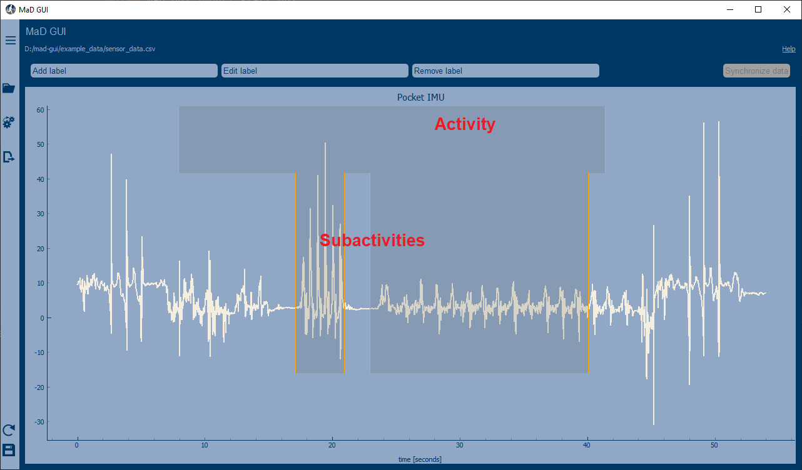

.. sectnum::

.. _custom labels:

******
Labels
******

Creating a Region Label
#######################

Labels can be used to create annotations in the GUI.
You can create your own label, which must inherit `BaseRegionLabel <file:///D:/mad-gui/docs/_build/html/modules/
generated/plot_tools/mad_gui.plot_tools.labels.BaseRegionLabel.html#mad_gui.plot_tools.labels.BaseRegionLabel>`_,
like this:

.. code-block:: python

    from mad_gui.plot_tools.base_label import BaseRegionLabel
    from mad_gui import start_gui

    class Status(BaseRegionLabel):
       # This label will always be shown at the lowest 20% of the plot view
       min_height = 0
       max_height = 0.2
       name = "Anomaly Label"

       # Snapping will be done, if you additionally pass a Settings object to the GUI,
       # which has an attribute SNAP_AXIS. See the README, the part of Adjusting Constants
       # for more information
       snap_to_min = False
       # snap_to_max = False  # if setting this to `True`, set `snap_to_min` to `False` or delete it

       # User will be asked to set the label's description when creating a label.
       # This can have an arbitrary amount of levels with nested dictionaries.
       # This es an example for a two-level description:
       descriptions = {"normal": None, "anomaly": ["too fast", "too slow"]}

.. admonition:: Using your algorithm in the GUI
   :class: tip

   You need to pass the label class (and optionally other plugins) to the start_gui
   function, see `Readme: Developing Plugins <https://mad-gui.readthedocs.io/en/latest/README.html#developing-plugins>`_.

The `description` defines the possible strings that can be assigned to a label. They will automatically show up after
adding a new label or by clicking on a label when in `Edit label` mode, such that the user can select one of the
descriptions. In our `exemplary video <https://www.youtube.com/watch?v=Ro8bOSjIg5U&t=12s>`_, this is
`{"stand": None, "walk": ["fast", "slow"], "jump": None}`.

Creating an Event Label
#######################

This kind of events can be plotted in the GUI, when the user uses `Ctrl` + `LeftMouseClick`/`Space`.
See the above section for more infos on class attributes, and our
`exemplary video <https://www.youtube.com/watch?v=Ro8bOSjIg5U&t=12s>`_ for more information on labelling.

.. code-block:: python

    class MyEvent(BaseEventLabel):
        min_height = 0
        max_height = 1
        name = "Peak"
        descriptions = {"Positive peak": None, "Negative peak": None}
        snap_to_min = False
        snap_to_max = False

Using more than one category of labels
######################################

You can also pass several labels to the GUI. See the image below the code snippet to find out, what kind of annotations
can be created with these label classes:

.. code-block:: python

    from mad_gui.plot_tools.labels.base_label import BaseRegionLabel
    from mad_gui import start_gui

    class LayerOne(BaseRegionLabel):
       # This label will always be shown at the upper 20% of the plot view
       min_height = 0.8
       max_height = 1
       name = "Activity"
       # description = see first code snippet on this page

    class LayerTwo(BaseRegionLabel):
       # This label will always be shown at the lowest 20% to 80% of the plot view
       min_height = 0.2
       max_height = 0.8
       name = "Sub-Activity"
       # description = see first code snippet on this pag

   start_gui(labels=[LayerOne, LayerTwo])

